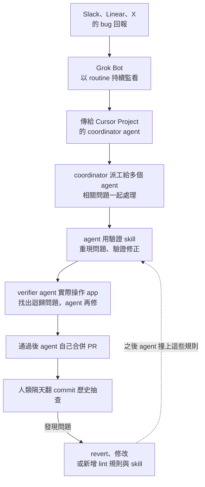

*"here's how i shipped 2,500 PRs last month to production"*

這是 Poteto 九月下旬發在 X 上的演講標題。十月三日，Matt Pocock 把這位 pstack 作者請上直播，花了一個多小時逐題追問。Matt 自己也在準備軟體工廠方向的課程，想知道從一次顧一到五個 agent，到同時有上百個在跑，中間到底隔著什麼。

Matt 的第一個問題，圍繞著 Poteto 常提的信任階梯（trust ladder）：越信任 agent，就越敢把更難的事交給它，也越敢同時放更多個去跑（[00:02:42](https://www.youtube.com/watch?v=MN9dGgmLyso&t=162s)）。訪談裡有不少內容，都在談這個信任是怎麼蓋起來的。

聽到 2,500 這個數字，最常見的反應是：這些 PR 你怎麼審得完？Poteto 說，每次提到這個數字，被問最多的就是這句（[00:41:06](https://www.youtube.com/watch?v=MN9dGgmLyso&t=2466s)）。這個問題背後有個預設：每個 PR 都得有人從頭讀到尾。以下依訪談的順序，看這個預設怎麼被一層層拆開：先談怎麼讓 agent 看得見自己的成果，再談怎麼整理環境，審查要等到很後面才輪到。

> **這篇怎麼讀**：除特別標明外，文中的做法與經驗都是 Poteto 在訪談中的自述；Matt 的提問與看法會註明是 Matt 說的。文中的時間點可以跳到影片對應位置（取自字幕檔，與播放位置可能略有出入）。逐字稿是自動轉寫，專有名詞已依官方資料校正。

## 認識 Poteto 與 pstack

Poteto 是 pstack 的作者。pstack 的 `plugin.json` 作者欄寫 Lauren Tan，[README](https://github.com/cursor/plugins/tree/main/pstack) 自述曾在 Meta、Netflix、Cursor 工作，也是 React core team 成員，參與 React Compiler。訪談結尾，Matt 以 Lauren 稱呼 Poteto（[01:06:18](https://www.youtube.com/watch?v=MN9dGgmLyso&t=3978s)）。

Poteto 目前在 Cursor 工作。這家公司在 2026 年 8 月 14 日[正式被 SpaceX 收購](https://cursor.com/blog/joining-spacex)，影片裡的「SpaceX AI」，對應的是官方名稱 SpaceXAI。

pstack 是 Cursor 的一個開源外掛（MIT 授權），收在 Cursor 官方的 cursor/plugins 庫裡。裡面的 skill 是用 Markdown 寫成的工作流程，agent 照著做。README 還把常見任務整理成 23 個 playbook（例如修 bug、效能調查、重構），另有 24 條各自獨立的 principle（例如「做完之後，要用真實的成品證明它能用」）。入口是 `/poteto-mode`：它讀你的需求，挑一個 playbook，再叫出需要的 skill。

關於那個數字：2,500 是 Poteto 自己的說法，沒有外部稽核。訪談中 Poteto 也說過「2000 or however many」（[00:39:56](https://www.youtube.com/watch?v=MN9dGgmLyso&t=2396s)），所以本文寫作約 2,000 至 2,500 個，細節見文末資料卡。

## 一、從「肉體代理人」開始

故事的起點是一次倦怠。Poteto 離開 Meta 後休息了一個月，接著做了倦怠的人常做的事：開一個新的 side project（[00:03:23](https://www.youtube.com/watch?v=MN9dGgmLyso&t=203s)）。時間是二月前後，社群正迷上 orchestration，不少人在做自己的協調器。她也被帶著走，等回過神，發現自己花了大把時間貼身盯著單一個 agent，寫了一堆 skill，卻沒辦法衡量哪一個有用，用她的話說是 flying blind。那個專案叫 [noodle](https://github.com/poteto/noodle)，她說它後來成了 pstack 的基礎。

春天，Poteto 加入 Cursor，被拉去處理 agents window 的效能問題。她深入看 flame graph（效能火焰圖）和 heap snapshot（記憶體快照），同時發現自己又成了瓶頸：自己就是 agent 和 Chrome DevTools 之間的 meat proxy，肉體代理人（[00:06:19](https://www.youtube.com/watch?v=MN9dGgmLyso&t=379s)），也直說這讓人很煩。

Poteto 回頭看自己當初放棄的那批個人 skill，發現其中有些教訓還能用，尤其是驗證與嚴謹。她的觀察是，即使前沿模型也傾向走捷徑，所以很多 skill 的目標，變成「怎麼讓容易的事剛好就是對的事」（[00:07:24](https://www.youtube.com/watch?v=MN9dGgmLyso&t=444s)）。

Matt 順勢做了一次氣氛檢查：AI 愈來愈強，領域知識是不是在貶值？她的看法正好相反。模型愈強，瓶頸愈落在你能不能把意圖講清楚（[00:08:29](https://www.youtube.com/watch?v=MN9dGgmLyso&t=509s)）。她舉的例子是醫師或律師，只要稍微懂一點技術，就有機會做出很好的產品，前提是腦中的願景夠清楚。

Matt 說自己一直很在意措辭，因為 agent 會抓住某些詞，反覆使用。TDD 就是例子：重點不在你是否真的照 TDD 的流程做，而在這個詞讓 agent 開始寫測試、改變優先順序。Poteto 說自己照抄了他近期分享的一招，用 tautological（套套邏輯）這個詞來減少 agent 寫出的無用測試（[00:10:40](https://www.youtube.com/watch?v=MN9dGgmLyso&t=640s)），認為這類詞把大量意圖壓縮在裡面。

## 二、米其林廚房

Matt 把這場對話框成「軟體工廠」，Poteto 說自己從來不愛這個詞：講到工廠，人不會聯想到品質和手藝，但做產品的人在乎的正是這些（[00:12:32](https://www.youtube.com/watch?v=MN9dGgmLyso&t=752s)）。她停在「米其林廚房」，並說這個比喻剛好對應信任階梯。

比喻是這樣展開的。一個人在家做飯，什麼都自己來。家人一個個走進廚房，多數人會開始焦慮：沒人知道廚具放在哪，廚房的容量其實只有一個人（這句是 Matt 的措辭，[00:14:33](https://www.youtube.com/watch?v=MN9dGgmLyso&t=873s)）。要讓一群人同時有產出，就得想清楚怎麼分工，讓整體勝過各部分的加總。當上主廚，人不再親自煮每一道菜，要管的是食材什麼時候訂、怎麼存、什麼時候備。她把這個角色形容成廚房的 tech lead。盤子端出去，名字還是主廚的，聲譽也是。

她的說法是，現在的原料換了樣子：廚房怎麼布置、skill 怎麼寫、環境與程式碼庫長什麼樣，才是進到產品裡的食材。

## 三、先給 agent 一雙手和一對眼睛

如果只能留一個 skill，Poteto 選驗證。她的比喻是給 agent「手和眼」（[00:17:44](https://www.youtube.com/watch?v=MN9dGgmLyso&t=1064s)）：它能把程式跑起來，像一般使用者那樣操作，還能除錯、抓 trace 和 snapshot。

這也是 Poteto 進 Cursor 後做的第一個 skill（[00:18:06](https://www.youtube.com/watch?v=MN9dGgmLyso&t=1086s)）。當時手邊已有 `how`、`why`、`unslop` 這幾個 skill（今天都收在 pstack 裡），但不管它們多好用，她自己仍是 agent 與結果之間的代理人。agent 看不到自己的成果，就沒辦法迭代。所以 loop 這個詞在她眼裡，最關鍵的部分只有一個：驗證。

有了驗證，才談得上爬山（hill climbing）：有一把評分的尺，agent 就能持續嘗試改進（[00:19:21](https://www.youtube.com/watch?v=MN9dGgmLyso&t=1161s)）。她說這是實驗室常用的詞，並順帶提到 Karpathy 的 [autoresearch](https://github.com/karpathy/autoresearch)，一個讓 AI agent 在單張 GPU 的 nanochat 訓練上自動做實驗的專案，repo 建立於 2026 年 3 月 6 日。repo 的描述只講自動迭代。

Cursor 內部的驗證 skill 現在有很多個，其中一個會自動維護，每個人都在用，她稱它是關鍵基礎設施（[00:20:21](https://www.youtube.com/watch?v=MN9dGgmLyso&t=1221s)）。

### 把確定的部分變成腳本

Matt 說在 Poteto 的演講裡看到一支客製的 CLI，問它做什麼、為什麼要做（[00:20:34](https://www.youtube.com/watch?v=MN9dGgmLyso&t=1234s)）。

起初的理由是 context window。去年底到今年一月，大家都擔心壓縮過後 agent 會變笨，所以要省 context。現在這個顧慮淡了，CLI 卻留了下來，因為它解決了另一件事（[00:21:59](https://www.youtube.com/watch?v=MN9dGgmLyso&t=1319s)）。沒有 CLI 的時候，每個 agent 驗證時都要重新搭一遍環境，而且每個搭得都不一樣；上一個 agent 寫好、跑通的腳本，用完就丟。浪費的是 context，也是時間。

Poteto 把工作想成一條光譜：一端需要判斷，得把多份資訊拼起來思考；另一端純屬機械，例如把一種寫法改成另一種。後者不需要 agent 每次想出新方法，所以她的習慣，是把確定的部分抽成程式，只把需要判斷的部分留給 agent，skill 本身變成一層薄薄的說明。大規模遷移也這樣做：用 code mod（自動改寫程式碼的腳本）、走語法樹（AST），讓腳本機械地改（[00:25:45](https://www.youtube.com/watch?v=MN9dGgmLyso&t=1545s)），不讓 agent 逐檔重寫。

她對自己這支 CLI 的評價很低調：沒有什麼新穎，就是串 Playwright、Chrome DevTools protocol 和一堆 API 的膠水（[00:23:32](https://www.youtube.com/watch?v=MN9dGgmLyso&t=1412s)）。Matt 的解讀是，這等於把資訊藏在 skill 外面，讓 skill 保持短小，agent 也更穩定地做同一件事。

> **pstack 對照**（README）：`create-verification-skill` 為沒有腳本化驗證的專案產生專屬的驗證 skill；`maintain-verification-skill` 在驗證 skill 與實際 app 脫節時做修正；`build-the-lever` 原則則是碰到不瑣碎的工作，先做出能完成或證明它的工具，因為工具是審查者可以重跑的成品。

## 四、新的工作是整理廚房

Matt 先給了一個定義：好的程式碼庫，是容易改的程式碼庫。換句話說，人和 agent 都被限制在很窄的路徑上。她接著說，工程師的新工作，很大一部分就是花時間在這個環境上（[00:27:28](https://www.youtube.com/watch?v=MN9dGgmLyso&t=1648s)）。

沒做這件事的人，容易卡在信任階梯的低層：對 agent 沒信心，唯一的辦法是貼身微管理，而微管理耗掉所有時間，沒有餘裕改善自己的做法（[00:27:43](https://www.youtube.com/watch?v=MN9dGgmLyso&t=1663s)）。她用工具比喻：就像一個開發者沒聽過 VS Code、Vim，連 Git 都沒聽過，只用記事本，deadline 逼近時也只能拿鈍刀硬切。切蒜太慢，就用壓蒜器，工具被發明是有原因的。

她還談到 TypeScript 的 type narrowing：從什麼都可能是的寬型別，靠型別守衛與執行期檢查，縮小到「這不只是 string，是一種特定的 string」（[00:30:28](https://www.youtube.com/watch?v=MN9dGgmLyso&t=1828s)）。她認為程式碼庫的約束與此同理：縮小可能性的空間，最好只剩一種做法。

她正在做一套內部框架（逐字稿轉寫為 Dune，名稱未能查證），形容它像 Electron app 的內部版 Next.js。它不開源，附帶很嚴格的 lint 規則（程式碼的自動檢查），結構上也只留一種做法：每個 feature 有自己的目錄，新功能就往新目錄放。這個設計源自一次教訓：Grok Bot 最初幾版，是 8 個各超過一萬行、什麼都往裡面塞的 God file（上帝檔案）（[00:32:39](https://www.youtube.com/watch?v=MN9dGgmLyso&t=1959s)），她只好把它拆開。

從那次經驗長出一個習慣：觀察 agent 怎麼失敗，每看到一個錯誤，就想怎麼把它變成 lint 規則，讓程式碼庫根本不讓這種錯發生（[00:32:59](https://www.youtube.com/watch?v=MN9dGgmLyso&t=1979s)）。Matt 的總結是，這樣 agent 不必記住一堆規則，走著走著撞上，就在對的時機被擋下來。

> **pstack 對照**（README）：`encode-lessons-in-structure` 原則是把規則寫成 lint、metadata 旗標、執行期檢查或腳本，而不是再多寫文字。

## 五、這麼多 PR 從哪裡來：兩個迴圈

**編者註**：Grok Bot 在 8 月 11 日才推出 beta，Cursor Projects 在 9 月 10 日才推出，而貼文講的是「上個月」的 PR，所以這些工具不能全算成那個月 PR 數的功臣。不過 Poteto 自己，確實把這個量歸因於下面這些迴圈。本節描述的是 Poteto 現在的做法。

Poteto 先把前提說清楚：沒有前面那些環境工作，做不到這個量（[00:34:44](https://www.youtube.com/watch?v=MN9dGgmLyso&t=2084s)）。她的說法是，自己先蓋好一間廚房、一間餐廳，之後就不必再親自在場。Matt 接了一句「你開了一家連鎖餐廳」，她補充：每個專案、每個大聊天，就像一間餐廳，自己在幾間之間像直升機那樣來回巡（[00:35:44](https://www.youtube.com/watch?v=MN9dGgmLyso&t=2144s)）。

Poteto 在這裡做了一個區分，自己也說「不確定定義用得對不對」（[00:36:37](https://www.youtube.com/watch?v=MN9dGgmLyso&t=2197s)）：

- **內迴圈**：agent 工程師為了某個意圖的快照在寫程式。
- **外迴圈**：那份快照會過期。新資訊出現在 Slack、Linear、X，出現在別人說的一句話裡。過去只有 Poteto 自己能當搬運工，把背景一份份搬給 agent。

她的目標，是把外部觸發接進內迴圈，讓 agent 自己取得背景。這裡用到 Grok Bot：它有 connector（串接外部服務的連接器），可以設定定期執行的 routine，持續監看 Slack 頻道、信箱或 Linear。官方文件列出的整合包含 Slack、email、calendar、issue tracker 等；Linear 不在官方使用案例頁，是 Poteto 自述的用法。她也說可以用其他工具（[00:42:05](https://www.youtube.com/watch?v=MN9dGgmLyso&t=2525s)），原則本身不綁定某個產品。她舉了個簡單的例子：假設有 Slack MCP，或自己的 harness 訂閱了某個 Slack 頻道，就能叫 agent 每逢 bug 回報就去分流，用先前累積的驗證 skill 重現問題，確認 main 上確實還有這個 bug，排除是使用者的環境、資料或沒裝套件造成的（[00:38:23](https://www.youtube.com/watch?v=MN9dGgmLyso&t=2303s)）。

Poteto 說這一段有個大主題：不斷問自己，我在哪裡是瓶頸？為什麼 agent 需要我來回答這個問題？目標是讓 agent 自己回答，而且靠真實資料，不靠幻想或猜（[00:39:08](https://www.youtube.com/watch?v=MN9dGgmLyso&t=2348s)）。談到 company brain、context graph 這類詞，她說它們不見得複雜或抽象，本質上就是把 agent 需要、原本要自己傳遞的資訊，教它自己去拿（[00:39:30](https://www.youtube.com/watch?v=MN9dGgmLyso&t=2370s)）。

Poteto 說自己沒有一個一個去開上千個聊天。大量使用的是 Cursor 新推出的 Projects，當作內迴圈，Grok Bot 則是外迴圈（[00:45:08](https://www.youtube.com/watch?v=MN9dGgmLyso&t=2708s)）。她還回憶，以前在 Netflix 的時候，管理者之間最常被提起的事情之一，是 context not control：給背景，不要控制（[00:42:43](https://www.youtube.com/watch?v=MN9dGgmLyso&t=2563s)）。她認為這很適用於 agent：教它自己取得資訊，就不必每一步盯著。

依[官方 changelog](https://cursor.com/changelog/projects)，一個 Project 在雲端自己的電腦上執行，合上筆電也不會中斷。它的 coordinator agent 自己不寫程式，負責規劃、建立並管理實作的 agents。她稱它是你的 executive chef、你的 chief of staff（[00:44:10](https://www.youtube.com/watch?v=MN9dGgmLyso&t=2650s)）。連 Cursor 都不必打開，只要對 Grok Bot 說「為這一串相關任務開一個 project」就好。

*編者整理的示意圖，非講者原圖；各環節是 Poteto 在訪談不同時間點分開講的。*

Matt 問：如果一次湧進 30 個 issue，coordinator 可以自己分派吧？Poteto 說是（[00:44:36](https://www.youtube.com/watch?v=MN9dGgmLyso&t=2676s)）。她的看法是，一個 issue 開一個 agent 當然也行，但串起它們的那條線就斷了，還可能重複工作。如果這些 issue 其實都在講效能，coordinator 能當成同一個問題來想；多份略有差異的回報，有時反而幫人拉遠一點，看出真正的問題比第一份回報顯示的位置更高一層。

這些 PR 也不全是新功能。Poteto 說有不少工作是 gardening，也就是整理庭園（[00:47:16](https://www.youtube.com/watch?v=MN9dGgmLyso&t=2836s)）。順帶一提，好環境對新進同事一樣有用：第一天就能產出像樣的程式碼，不必先開一堆低品質的 PR。她舉了一個做法：React 有很多容易踩的坑，所以有個 agent 不斷找壞寫法，但刻意不讓它馬上修，而是先追加到一份文件裡，每隔幾天回頭看一次，她會說「這些其實是同一件事」（[00:49:03](https://www.youtube.com/watch?v=MN9dGgmLyso&t=2943s)）。她認為，只顧著執行進來的訂單，容易錯過全貌，緩衝區正好逼人看見大局。

Poteto 說自己現在相當於有超過 10 個 chief of staff，各管一個領域（[00:53:22](https://www.youtube.com/watch?v=MN9dGgmLyso&t=3202s)）：一個盯 Grok Bot 桌面 app 的效能，一個修使用者回報的 bug，一個純粹好玩地探索換語言重寫，看看原生 app 會是什麼樣子。

## 六、抽樣，而不是把關

Poteto 對「這個量從哪裡來」最直接的回答，是倒推一個問題：怎麼走到 agent 能合併自己程式碼的那一步（[00:40:46](https://www.youtube.com/watch?v=MN9dGgmLyso&t=2446s)）。這句話一出，Matt 先請 Poteto 稍等，聊完迴圈再回頭。回頭之後的答案是：沒有每道菜都嘗。

Poteto 說，不想走到永遠不嘗味道的地步，但在這個規模下也不可能每一道都試，所以改成抽樣。談到這裡，她自己說，工廠的比喻在這裡反而更貼切：像工廠的品管主管，不可能逐件檢查，但每天進去看 PR 的品質，嚴格檢視 agent 寫的程式碼（[00:50:56](https://www.youtube.com/watch?v=MN9dGgmLyso&t=3056s)）。發現問題，要修的是環境。一次性的事件，也許不用處理；如果看到多個 agent 犯同樣的錯、走同樣的捷徑（[00:51:47](https://www.youtube.com/watch?v=MN9dGgmLyso&t=3107s)），就是該調整廚房的訊號：改 skill、約束、lint、型別系統。

Poteto 也坦白說，這條路不容易。不是裝了 pstack 就能得到，要花很多時間想程式碼、觀察 agent 在哪裡失敗，再有意識地設下護欄（[00:52:28](https://www.youtube.com/watch?v=MN9dGgmLyso&t=3148s)）。

### 這算不算「黑燈工廠」

Matt 先問，這是不是「黑燈工廠」：完全不開燈、沒人看管的全自動生產（[00:52:56](https://www.youtube.com/watch?v=MN9dGgmLyso&t=3176s)）。Poteto 承認，從某個角度看算：agent 自己合併 PR，人就去睡覺了，agent 二十四小時工作。她提到 pstack 裡的 full autopilot（對應 README 的 `autopilot-full` playbook）。依她的說法，啟動後會對每個 PR 叫出一批 verifier agent，用 fuzzing 的方式實際跑起 app、像真人一樣亂點，找迴歸問題和 bug，agent 自己修，再來一輪，直到 PR 能合併（[00:53:58](https://www.youtube.com/watch?v=MN9dGgmLyso&t=3238s)）。

代價也說得直接：非常吃 token（[00:54:37](https://www.youtube.com/watch?v=MN9dGgmLyso&t=3277s)）。可以調整，十個 verifier 換成一個，或只叫 agent 自己驗證一下。

Poteto 把敢放手的原因，歸給兩樣東西的組合：驗證，加上環境（[00:54:52](https://www.youtube.com/watch?v=MN9dGgmLyso&t=3292s)）。

人在哪裡？合併之後，隔天早上看 commit 歷史。發現問題就 revert 或修改，並新增 lint 規則（[00:55:05](https://www.youtube.com/watch?v=MN9dGgmLyso&t=3305s)）。

第一天打開自主合併的那晚很害怕，擔心自己造成 sev（嚴重的線上事故）。她說這需要不少勇氣，現在睡得更好了（[00:55:26](https://www.youtube.com/watch?v=MN9dGgmLyso&t=3326s)）。

Matt 指出，這和 Karpathy 最初定義的 vibe coding（程式碼幾乎不存在）不同。她同意，並提出一個畫面：也許有個調光開關，有些區域暗，有些亮，所以餐廳比工廠更貼切，餐廳老闆偶爾還是會去店裡看一眼、嘗一口（[00:56:25](https://www.youtube.com/watch?v=MN9dGgmLyso&t=3385s)）。他把這濃縮成一句：抽樣，而不是擋路。

> **pstack 對照**（README）：`autopilot-full` playbook 的描述是「讓獨立的 PR 走到合併，每個 PR 一個負責的 owner，每一輪由根層的 swarm 給出判定」；`never-block-on-the-human` 原則是先往前走，呈現結果，讓人事後修正，只有不可逆的動作才保留確認。

## 七、遇到單向門怎麼辦

Matt 提出最難的一題：Poteto 所在的環境很重視安全，但有些人做的是醫療、法律或金融（[00:57:04](https://www.youtube.com/watch?v=MN9dGgmLyso&t=3424s)）。他把 PR 分成兩種門：可以合併後再 revert 的，是雙向門；會造成資料遺失、難以回頭的，是單向門。如果大多數 PR 都是單向門呢？

她的回答，取決於驗證做得多好。領域本身可驗證時，單向門在某種程度上會變成雙向門；很難用程式驗證的領域，就很難走到這一步。軟體工程恰好大多可驗證，數學的某些面向也是。至於全是單向門的團隊該怎麼辦，她老實說這是個好問題，自己沒有答案（[00:58:44](https://www.youtube.com/watch?v=MN9dGgmLyso&t=3524s)）。

她的期待放在為 agent 設計的新語言。其中一個最讓她著迷的是 Bend，形容它把寫程式與寫證明結合在一起（[00:59:05](https://www.youtube.com/watch?v=MN9dGgmLyso&t=3545s)）。過去要證明程式正確，得換另一種語言，像 Lean、TLA+（專門用來寫形式證明的工具），用 solver 檢查有沒有涵蓋所有情況、有沒有 race condition。如果證明顯示正確，為什麼不直接合併？

Bend 要註明版本。Bend 原本以大規模平行運算聞名，但官方 [repo](https://github.com/bendlang/bend) 現在的描述是「Bend 2：一個藉由證明擋下 AI 錯誤的快速語言」。她只說 Bend；對照官方 repo，「程式與證明結合」這個描述屬於 Bend 2。

## 八、刀要自己磨

最後 Matt 問了很多人心裡有的問題：pstack 和我的 skill，到底該用哪一套？談話中也提到一個當天被提起的技巧：回頭掃自己過去的對話紀錄，找出你一再糾正 agent 的地方，把學到的東西變成可重複使用的 skill（[01:01:44](https://www.youtube.com/watch?v=MN9dGgmLyso&t=3704s)）。

Poteto 認為兩者互補。skill 說穿了就是把流程變成文字，是 Markdown。她更在意的畫面是：每位廚師換餐廳，都帶著自己的刀（[01:02:51](https://www.youtube.com/watch?v=MN9dGgmLyso&t=3771s)）。她說，信任說到底，是信任自己的工具。有人會把 Matt 的 `grill-with-docs` 或 `wayfinder` 搭配 pstack 裡執行類的 skill，有人多用 Matt 的，有人多用 Poteto 的，每個人最後的組合都不同。

> **對照**：`grill-with-docs`、`wayfinder` 在 [mattpocock/skills](https://github.com/mattpocock/skills)，`poteto-mode` 在 [pstack](https://github.com/cursor/plugins/tree/main/pstack)。逐字稿把 `poteto-mode` 轉寫成 "potato mode"、把 `grill-with-docs` 轉寫成 "grill me with docs"，此處依 repo 目錄名稱校正。

Poteto 說，過去的對話紀錄是寶庫，因為那是「實際發生過的流程」，不是腦中的抽象想像（[01:03:49](https://www.youtube.com/watch?v=MN9dGgmLyso&t=3829s)）。pstack 裡的 `recall` 就是這樣來的：她做 Cursor app 的虛擬化時 bug 很多，每次開新對話，都想把上一次的背景帶過來。`recall` 把這個流程壓縮成一個 skill，不必每次寫一大篇說明。

> **pstack 對照**（README）：`recall` 會用你自己的聊天紀錄與共享紀錄，重建某個主題的近期背景，交回一份精簡的現況簡報；`automate-me` 會挖你最近的對話紀錄，依你實際的工作方式起草一個專屬的 `<你的名字>-mode`。

她也預測 skill 會愈來愈短。去年的 skill 比較像實作細節，列出確切的指令；有了新一代模型，可以把這些刪掉，專注在流程，skill 變成一連串步驟（[01:05:11](https://www.youtube.com/watch?v=MN9dGgmLyso&t=3911s)）。

收尾時兩人聊到：skill 裡沒有魔法，就是文字。如果有任何魔法，也只在於選了哪些字、用了哪些措辭，以及把抽象流程轉成語言時付出的思考（[01:05:56](https://www.youtube.com/watch?v=MN9dGgmLyso&t=3956s)）。

## 重點結論與實際啟示

以下七點是編者整理的，順序並非 Poteto 在訪談中給的。它們都從同一個問題出發：我在哪裡是瓶頸？

1. **先找出自己在當肉體代理人的地方。** agent 和工具、和外部系統之間，哪些來回是你在手動傳遞？
2. **第一個 skill 做驗證。** 讓 agent 看得到自己的成果，迴圈才成立。
3. **把確定的部分寫成腳本。** skill 只留需要判斷的部分。
4. **看到多個 agent 重複同一個錯，就改環境。** lint 規則、型別、目錄慣例，比只糾正那一個 agent 有用。
5. **把外部觸發接進內迴圈。** 讓 agent 從 Slack、issue tracker 自己取得背景。
6. **要放手之前，先想清楚你的領域驗證得了多少。** 她敢放手，靠的是驗證加環境；領域能驗證，單向門有機會變成雙向門，不能的話，她自己也說沒有答案。
7. **回頭挖自己的對話紀錄，當作 skill 的原料。**

### 保留意見

- 訪談沒有談到團隊規模、token 預算或事故紀錄，具體提到的事故風險只有第一晚擔心造成 sev。其他團隊能複製到什麼程度，影片沒有給答案。

## 查證資料卡

| 項目 | 內容 | 依據 |
|---|---|---|
| 月 PR 數 | 本人自報約 2,000 至 2,500 個。貼文標題寫 2,500，訪談中 Poteto 說 "2000 or however many"。Cursor Compile London 議程上，Lauren Tan 的演講標題則是 "I Shipped 2,000 PRs Last Month" | [影片](https://www.youtube.com/watch?v=MN9dGgmLyso&t=2396s)、[Compile London 議程](https://cursor.com/compile/london)；[X 貼文](https://x.com/poteto/status/2102050467505430555)（需登入，未直接核對） |
| Cursor 被收購 | 2026-08-14 正式被 SpaceX 收購 | [Cursor 官方部落格](https://cursor.com/blog/joining-spacex) |
| Cursor Projects | 2026-09-10 推出；雲端的 coordinator agent 負責規劃與派工 | [官方 changelog](https://cursor.com/changelog/projects) |
| Grok Bot | 2026-08-11 由 SpaceXAI 推出 beta，Cursor 付費方案也能使用 | [官方公告](https://x.ai/news/introducing-grok-bot)、[文件](https://docs.x.ai/grok-bot/overview) |
| pstack | MIT 授權；作者欄 Lauren Tan；README 自述 23 個 playbook、24 條 principle（v0.15.6） | [官方 repo](https://github.com/cursor/plugins/tree/main/pstack) |
| autoresearch | repo 建立於 2026-03-06 | [GitHub](https://github.com/karpathy/autoresearch) |

## 來源

**影片與逐字稿**

- [LIVE: Poteto (creator of pstack) on shipping 1,000's of PR's a month at SpaceX](https://www.youtube.com/watch?v=MN9dGgmLyso)（Matt Pocock 頻道，2026-10-03）。逐字稿為自動轉寫。

**官方與第一手**

- [pstack（cursor/plugins）](https://github.com/cursor/plugins/tree/main/pstack)：README、`plugin.json`、LICENSE（2026-10-03 讀取，v0.15.6）
- [Cursor is now a part of SpaceX](https://cursor.com/blog/joining-spacex)（2026-08-14）
- [Cursor Projects changelog](https://cursor.com/changelog/projects)（2026-09-10）
- [Introducing Grok Bot](https://x.ai/news/introducing-grok-bot)（2026-08-11）、[Grok Bot 文件](https://docs.x.ai/grok-bot/overview)、[使用案例](https://docs.x.ai/grok-bot/use-cases)
- [Cursor Compile London 議程](https://cursor.com/compile/london)：Lauren Tan 的演講標題為 "I Shipped 2,000 PRs Last Month"（2026-10-03 讀取）
- [karpathy/autoresearch](https://github.com/karpathy/autoresearch)
- [Bend（bendlang/bend）](https://github.com/bendlang/bend)：原 HigherOrderCO/Bend 已轉址至此
- [mattpocock/skills](https://github.com/mattpocock/skills)
- [poteto/noodle](https://github.com/poteto/noodle)

**未能直接核對**

- [Poteto 的 X 貼文](https://x.com/poteto/status/2102050467505430555)：X 頁面需登入。標題與發文日期（約 2026-09-21）來自搜尋結果，未直接核對原頁。
